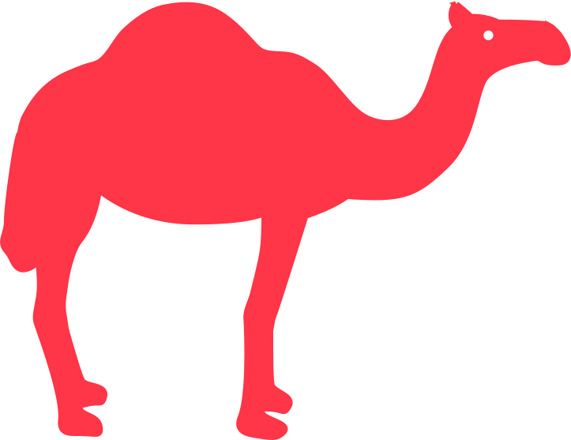

  
  <h1>Camel Notes</h1>
  
  <h3>A simple note-taking web application in React</h3>

  <a href="https://camelnotes.netlify.app/"><h3>Try me!</h3></a>

  

## Technologies Used

&nbsp;&nbsp;&nbsp;&nbsp;&nbsp;&nbsp;

&nbsp;&nbsp;&nbsp;&nbsp;&nbsp;&nbsp;

&nbsp;&nbsp;&nbsp;&nbsp;&nbsp;&nbsp;

&nbsp;&nbsp;&nbsp;&nbsp;&nbsp;&nbsp;

&nbsp;&nbsp;&nbsp;&nbsp;&nbsp;&nbsp;

&nbsp;&nbsp;&nbsp;&nbsp;&nbsp;&nbsp;

## Description

Camel Notes is a simple note-taking web application in React, that I had the chance to work with and to enhance its functionality while learning React through Scrimba

## Dependencies

## How to Install

## Future Plans
- Add backend to save notes to server
- User accounts

## Demo

## Screenshots

