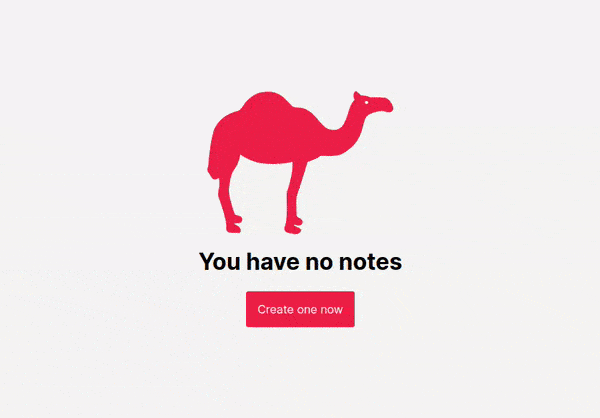
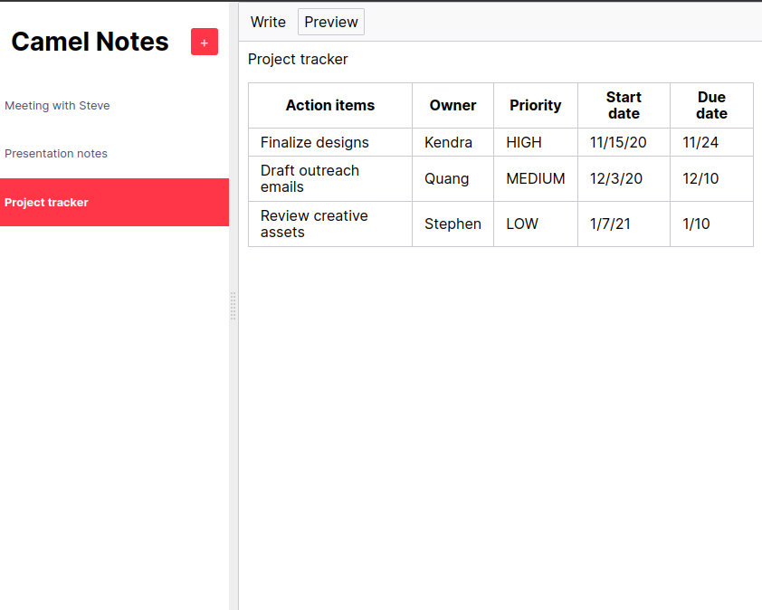
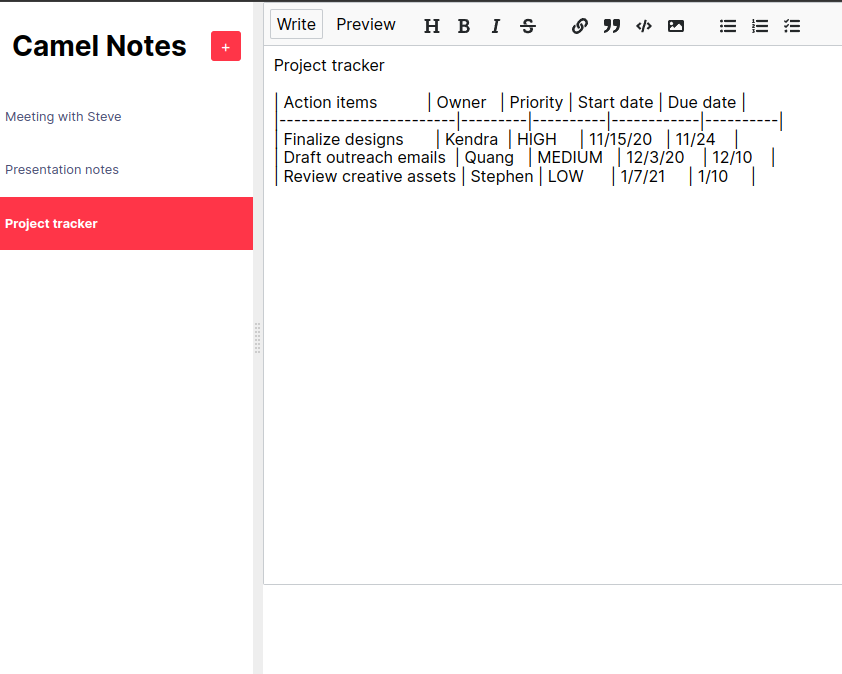
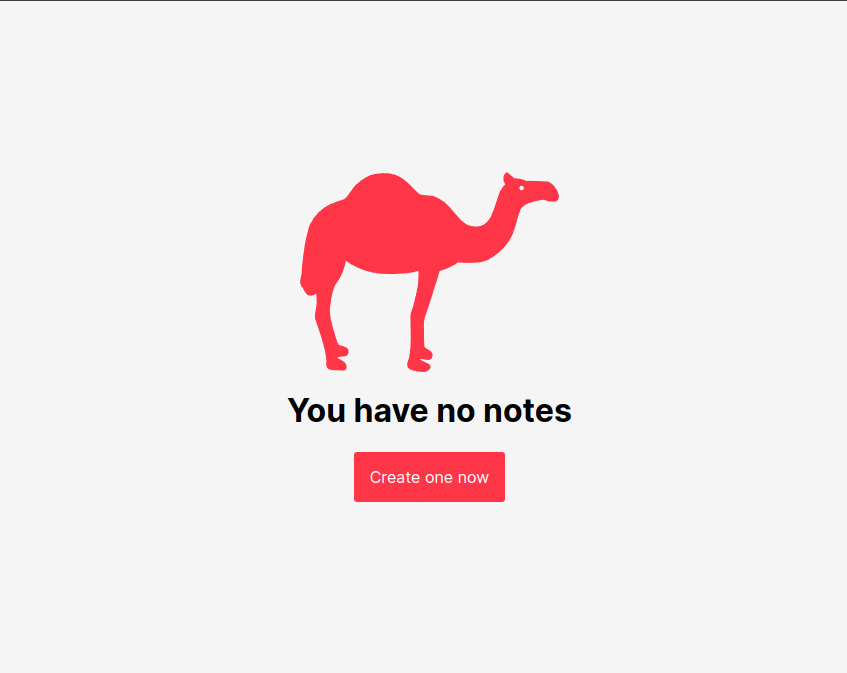

  
  <h1>Camel Notes</h1>
  
  <h3>A simple note-taking web application in React</h3>

  <a href="https://camelnotes.netlify.app/"><h3>Try me!</h3></a>

  

## Technologies Used

&nbsp;&nbsp;&nbsp;&nbsp;&nbsp;&nbsp;

&nbsp;&nbsp;&nbsp;&nbsp;&nbsp;&nbsp;

&nbsp;&nbsp;&nbsp;&nbsp;&nbsp;&nbsp;

&nbsp;&nbsp;&nbsp;&nbsp;&nbsp;&nbsp;

&nbsp;&nbsp;&nbsp;&nbsp;&nbsp;&nbsp;

&nbsp;&nbsp;&nbsp;&nbsp;&nbsp;&nbsp;

## Description

Camel Notes is a simple note-taking web application in React, that I had the chance to work with and to enhance its functionality while learning React through Scrimba

Note: The project only compiles in development mode. When attempting to compile in production mode, as error is caused by one of the dependencies. (Check Issue https://github.com/michaelkolesidis/camelnotes/issues/1 for more info)

## Future Plans
- Add backend to save notes to server
- User accounts

## Demo

## Screenshots

## License

Copyright (c) 2022 Michael Kolesidis 
Licensed under the [GNU General Public License v3.0](https://www.gnu.org/licenses/gpl-3.0.html).

 
 

[//]: # (Free Software)

   
   

  

                                                       

  

